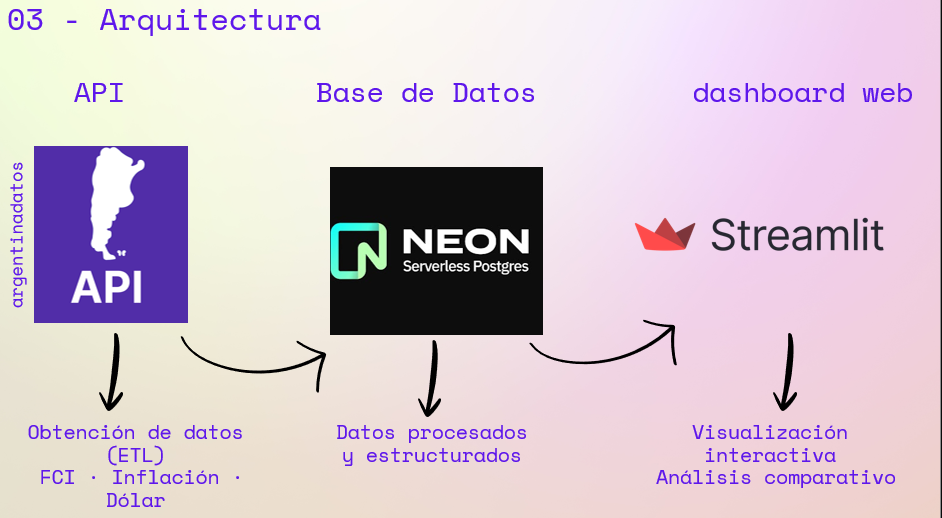

# 📊 Monitor Financiero – Proyecto Final

Proyecto final del Bootcamp 4.0 (Devlights), enfocado en el análisis, procesamiento y visualización de datos financieros mediante un pipeline de datos y un dashboard interactivo.
---

## 🎯 Objetivos
- Analizar la evolución de distintos FCI.
- Comparar rendimientos contra inflación y tipo de cambio.
- Construir un pipeline de datos reproducible.
- Visualizar métricas clave en un dashboard interactivo.

## 🛠️ Tecnologías

- **Lenguaje:** Python  
- **Análisis de datos:** Pandas, NumPy  
- **Visualización:** Matplotlib, Seaborn, Plotly, Streamlit  
- **Base de datos:** PostgreSQL (Neon)  
- **Acceso a datos:** SQLAlchemy, psycopg2, Requests  
- **Infraestructura:** Docker, Docker Compose  
- **Control de versiones:** Git & GitHub  
- **Arquitectura:** ETL, consumo de APIs

## 📂 Estructura del proyecto

```text
PROYECTO FINAL/
│
├── .devcontainer/                 # Configuración del entorno de desarrollo (Docker)
│
├── Dashboard/
│   └── monitor_financiero.py      # Aplicación de visualización (Streamlit)
│
├── Documentación/
│   └── BASES_DE_DATOS_USADAS.docx # Documentación de las fuentes de datos
│
├── notebooks/
│   └── EDA.ipynb                  # Análisis Exploratorio de Datos (EDA)
│
├── screenshots/                   # Capturas del dashboard
│
├── Script/
│   ├── DOLAR_AHORA_ETL.py          # ETL de cotizaciones actuales de distintos tipos de dólar
│   ├── DOLAR_hist_ETL.py           # ETL histórico de cotizaciones del dólar
│   ├── FCI_api_ETL.py              # ETL de FCI (Ualá, Mercado Pago, Personal Pay)
│   ├── INFLACION_api_ETL.py        # ETL de inflación mensual en Argentina
│   └── plazoFijo_api_ETL.py        # ETL de tasas de plazo fijo (histórico)
│
├── .env.example                    # Ejemplo de variables de entorno
├── .gitignore                      # Archivos ignorados por Git
├── backup_finanzas.sql             # Backup de la base de datos
├── docker-compose.yml              # Orquestación de servicios con Docker
├── Dockerfile                      # Imagen del proyecto
├── requirements.txt                # Dependencias del proyecto
└── README.md
```

## 🏗️ Arquitectura del Sistema
<p align="center">
  
</p>
La arquitectura del sistema se basa en un flujo ETL donde los datos financieros se obtienen desde distintas APIs públicas, se procesan y almacenan en una base de datos PostgreSQL (Neon) y finalmente se consumen desde un dashboard web desarrollado en Streamlit para su análisis interactivo.

## 💡 Problema que resuelve

El proyecto permite centralizar y analizar información financiera dispersa (FCI, dólar e inflación), facilitando la comparación de rendimientos y el análisis de tendencias económicas de forma visual e interactiva.


## 🔌 Fuentes de datos

- Fondos Comunes de Inversión (FCI)
- Cotización del dólar (actual e histórica)
- Índices de inflación en Argentina
- Tasas de interés de plazos fijos

Las fuentes se consumen mediante APIs públicas y se integran en un pipeline ETL.

## 🌐 Dashboard Web

🔗 **Acceso directo al Dashboard**: [](https://monitorfinanciero-tytyevfsnybzcmu5twqtlh.streamlit.app/)

### ✨ Funcionalidades

- 📊 **KPIs en tiempo real**: Inflación, Dólar, Mejor FCI, Estado
- 🔮 **Proyección Simple**: Calcula rendimiento sin aportes adicionales
- 💎 **Proyección con Aportes**: Simula ahorro sistemático mensual
- 📊 **Comparador de Fondos**: Ranking automático con medallas 🥇🥈🥉
- 🎯 **Calculadora de Objetivos**: Calcula aportes para alcanzar tu meta
- 💵 **Cotizaciones en vivo**: Todos los tipos de dólar con spread
- 📈 **Análisis histórico**: Visualización de tendencias pasadas

### 🎮 Controles Interactivos

- **Período**: 7 a 90 días
- **Tipo de Dólar**: Blue, Oficial, MEP, CCL, Cripto, etc.
- **Métrica FCI**: VCP o TNA
- **Comparación**: Selección múltiple de instrumentos

## 📸 Capturas del Dashboard

### 📊 Dashboard principal


### 🔮 Proyección Simple: Calcula cuánto tendrás en X meses sin aportes
  


### 💎 Proyección con Aportes: Simula ahorro sistemático mensual
  


### 📊 Comparador de Fondos: Ranking automático de todos los FCIs
  


### 🎯 Calculadora de Objetivos: Calcula aporte mensual necesario para tu meta


---

### 📈 Análisis histórico: Visualización de datos pasados
   


---

### 💵 Cotizaciones: Dólar Blue, Oficial, MEP, CCL, Cripto
  


---
## A Futuro . . .

### En desarrollo
- [ ] Análisis de Escenarios (Optimista/Base/Pesimista)
- [ ] Notificaciones y alertas automáticas
- [ ] Exportar reportes en PDF/Excel
- [ ] Automatizar los procesos ETL

### Futuras mejoras
- [ ] Integración con más activos (CEDEARs, Bonos, ...)
- [ ] Machine Learning para predicciones
- [ ] API REST pública


## 🧠 Conclusiones

El proyecto integra análisis e ingeniería de datos en una solución completa, demostrando la capacidad de construir pipelines de datos y visualizaciones orientadas a la toma de decisiones.

## 👤 Autor

**Luciano Riquelme** 

Estudiante de Lic. en Sistemas 
Interés en Data Analytics y Data Engineering

- 🔗 LinkedIn: https://www.linkedin.com/in/luciano-riquelme  
- 📧 Email: luciano.luiz.riquelme@gmail.com

---
## 🙏 Agradecimientos

Bootcamp 4.0 – Devlights, por el acompañamiento y el tiempo brindados.


